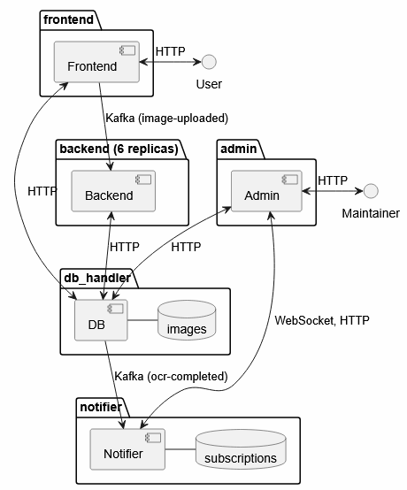

# VITMMB11 - Házi Feladat

## Bevezető

A jelen dokumentum a Felhők hálózati szolgáltatásai laboratórium (VITMMB11) tantárgy házi feladatának fejlesztői dokumentációja.

## Feladatkiírás

Egy olyan web szolgáltatás létrehozása, ami az alábbi funkciókat látja el:

- Kép és hozzá tartozó rövid leírás feltöltése és tárolása (kép-leírás páros tárolása);
- A feltöltött képen automatikus karakterfelismerés futtatása és a detektált szövegrészletek (szavak vagy karakterek) bekeretezésével a kép megjelenítése a weboldalon;
- A weboldal „üzemeltetői” számára feliratkozás megvalósítása, ami által értesítést tudnak kapni az összes eddigi és az oldalra újonnan feltöltött képekről úgy, hogy kiküldésre kerül számukra a képhez tartozó rövid leírás, és a képen detektált szöveges tartalom is.

##  Webszolgáltatás architektúra

Az alkalmazás általam lefejlesztett komponensei Python nyelven íródtak. A frontend Websocket kezelését a `socket.io` JavaScript függvénykönyvtár látja el.

Az alkalmazás hat elkülöníthető részből áll, ezek HTTP API-val, illetve Kafka üzentsorral kommunikálnak egymással:

| Komponens  | Funkció |
| ---------- | ------- |
| frontend   | A felhasználó felé elérhető weboldal megjelenítése, a feltöltött kép és leírás elküldése az adatbázis kezelőnek HTTP API-val, illetve a backend értesítése Kafka segítségével. |
| backend    | Kafka értesítés figyelése, az OCR generálás végrehajtása, a generálás végén az adatbázis kezelőnek a kigenerált kép és a rajta található szöveg elküldése HTTP API segítségével. |
| db_handler | Az eredeti, illetve a generált kép tárolása, a felhasználó által megadott leírás, illetve az OCR által felismert leírás tárolása. Amikor a teljes feldolgozás megtörtént értesíti Kafka segítségével a notifier-t. |
| admin | Az üzemeltetők felé elérhető weboldal megjelenítése, feliratkozás támogatása HTTP API-val, Websockettel az újonnan feldolgozott leírások letöltése és az üzemeltető értesítése. |
| notifier | Kiszolgálja a feliratkozás HTTP API-ját, feldolgozza a teljes képfeldolgozás Kafka eseményt, Websockettel kiértesíti a feliratkozott üzemeltetőket. |
| kafka | A Kafka komponens kiegészítve a topicok automatikus létrehozásával, megfelelő listener beállítással, illetve a partíciók beállításával. |

Az alkalmazás megvalósításához microservice ökoszisztémát használtam, mivel így a komponensek könnyedén kiterjeszthetők vertikálisan és horizontálisan, illetve az architektúra könnyedén módosítható, amennyiben az adott felhasználási mód azt kívánja.

A Dockerfileokban többlépéses build-et használtam, hogy az alkalmazások módosítása esetén ne kelljen újrafordítani a dependenciákat:

```
FROM python:alpine3.21 AS build
...dependenciák...
FROM build
...forrásfájlok...
```

A különböző microservice-k a service nevüknek megfelelő könyvtárban helyezkednek el az alkalmazás gyökérkönyvtárán belül.



Az architekturális ábrán az egyszerűség kedvéért a Kafka üzenetek direkt hívásként jelennek meg, ezekben az esetekben egy Kafka feliratkozásról van szó a nyíl végpontjában és egy publish-ról a kezdeti pontban. A package-ek konténereket jelölnek zárójelben az alapértelmezett replikákkal amennyiben az nem egy darab. A karikák felhasználói interakciót jelölnek.

A `backend` komponens támogatja a skálázódást, hogy lehetőség legyen a párhuzamos végrehajtásra, alapból 6 replikával indul az alapértelmezett docker compose alapján:

```
deploy:
    mode: replicated
    replicas: 6
```

Gondolkodtam FaaS használatán konténer replikák helyett, de a Tesseract a nyelvi fájlokkal együtt jelentős betöltési idővel és helyszükséglettel rendelkezik, így a konténer replikák mellett döntöttem.

A Kafka partíciók segítségével a Kafka egyenlő eloszlású terhelésre törekszik a Backenddel szemben:

```bash
sh /opt/kafka/bin/kafka-topics.sh --bootstrap-server localhost:9092 \
--topic image-uploaded --alter --partitions 6
```

Amikor a nagyméretű kép adatokat küldöm hálózaton, akkor szinkron HTTP kéréseket alkalmazok a felhasználói visszajelzés egyértelműsége, az adatbázis konzisztencia, illetve a Kafka relatív kis üzenetekre való optimalizálása miatt. A képleírások és értelmezett leírások viszont Kafka topicokban haladnak.

A felhasználói kommunikációnál az adatinicializációkhoz HTTP API endpointokat használok, hogy elkerüljem a sok kis méretű kérést, ami terheli a hálózatot, a notification-ökhöz viszont Websocket-et, amihez a Kafka juttatja el a feldolgozásról az értesítést.

A `notifier` és a `subscription` service technikailag lehetne különböző konténerben, de egybe vettem őket, mivel mindkettő a felhasználóval kommunikál közvetlenül.

Az `admin` és a `frontend` konténerek is load balancerrel skálázhatóak, ugyanis sehol sincsenek direktben behivatkozva.

### Frontend

A frontend konténerben egy `Flask` alapú webalkalmazás fut. A `Flask` `Blueprint` keretrendszerével történik a weboldalak és tartalmuk kigenerálása. A HTTP kéréseket a `requests` Python függvénykönyvtár segítségével szolgálom ki. A Kafka producert a `kafka-python` Python függvénykönyvtár segítségével használom.

A Flask alkalmazás a `frontend` könyvtáron belüli `frontend` könyvtárban egy `__init__.py` nevű fájlban van definiálva, az endpointok pedig a `gallery.py` nevű fájlban.

A konténert definiáló `Dockerfile`, illetve a python alkalmazás dependenciáit tartalmazó `requirements.txt` a `frontend` könyvtárban található.

A frontend konténer az alábbi web endpointokat szolgálja ki a felhasználónak:

#### /

- Metódus: GET
- Funkció: Letölti és megjeleníti a generált képeket az adatbázisból, amennyiben léteznek. Ha nem létezik egy kép, amit az alkalmazás egy `processed` nevű flag értékével ellenőriz, akkor egy frissítés gombot tesz elérhetővé, amivel a backend újra késztethető a kép generálására a `/refresh/<image_id>` endpoint segítségével.

Egy kép frontendre kirakott sora, ha ki lett generálva kép:

```json
{"src": "/app/frontend/static/images/<image_id>.png",
 "caption": <user_caption>}
```

Egy kép frontendre kirakott sora, ha még nem lett kigenerálva kép:

```json
{"id": <image_id>, "src": "empty", "caption": <user_caption>}
```

Ahol a <user_caption> mindkét esetben a felhasználó által megadott leírást jelenti.

#### /refresh/\<image_id\>

- Metódus: GET
- Funkció: Az endpoint, ahol a backend újra késztethető a kép generálására egy új `image-uploaded` Kafka notification létrehozásával. Ha már feldolgozta a képet a backend, akkor figyelmen kívül hagyja ezt a kérést a `processed` flag ellenőrzésével.

#### /upload

- Metódus: GET
- Funkció: Megjeleníti a képfeltöltési mezőt és a felirat megadási mezőt, illetve lehetővé teszi a felhasználónak, hogy ezeket feltöltse.

#### /upload-image

- Metódus: POST
- Funkció: A kép feltöltését végzi. Biztonsági ellenőrzések után (fájl jelen, PNG kiterjesztés) a kép base64-be lesz konvertálva, majd elküldésre kerül HTTP API segítségével a felirattal együtt az adatbázisnak JSON formátumban. Ez egy szinkron kérés az adatbázis `/upload` endpointja felé, hogy a kép biztosan bekerüljön az adatbázisba. Megvárja, amíg az adatbázis visszatér egy azonosítóval, vagy pedig kiírja a felhasználónak, hogy az adatbázis nem elérhető. Az azonosítóval ezután az `image-uploaded` topicba Kafka értesítést küld a backend-nek, hogy az meg tudja kezdeni a karakterfelismerést a képen. A backend aszinkron módon hajtja végre a feladatot, a frontend az értesítés kiküldése után sikerrel tér vissza a felhasználónak.

Adatbázisba küldött JSON:

```json
{"image": <kép_base64_formátumban>, "caption": <user_caption>}
```

### Backend

A backend konténerben egy egyedi Python modul fut. A HTTP kéréseket a `requests` függvénykönyvtár segítségével szolgálom ki. A Kafka producert a `kafka-python` Python függvénykönyvtár segítségével használom. Az OCR megoldáshoz a Tesseract szoftvert használom, ehhez a `Dockerfile` segítségével felraktam a `tesseract-ocr` csomagot a konténerbe, illetve a `tesseract-data-eng` és `tesseract-data-deu` csomagokat a leggyakoribb angol, illetve német nyelvek támogatására. Mivel az alkalmazást Python-ban írtam meg, ezért szükségem volt még a `pytesseract` modulra is. A dobozok felrajzolásához a `Pillow` könyvtárat használom.

Az alkalmazás a `backend` könyvtárban egy `app.py` nevű fájlban van definiálva.

A konténert definiáló `Dockerfile`, illetve a python alkalmazás dependenciáit tartalmazó `requirements.txt` a `backend` könyvtárban található.

Az alkalmazás az alábbi műveleteket végzi:

- Az alkalmazás indításkor egy Kafka consumer segítségével feliratkozik az `image-uploaded` topicra a `backend-group` group id-val. A group id elengedhetetlen, hogy a backendek tudjanak szinkronizálni, hogy éppen melyik képet dolgozzák fel.
- Amikor érkezik egy üzenet a topicra a kép azonosítójával lekérdezi a kép adatait az adatbázisból a `/image/raw/<image_id>` HTTP endpoint segítségével.
- Ha erre azt kapja vissza, hogy nincs ilyen azonosító, akkor feltételezi, hogy stale azonosítóról van szó és feldolgozottnak jelöli az eseményt.
- Ha adatbázis hiba van, akkor feldolgozottnak jelölés nélkül továbbmegy a következő elemre.
- Amennyiben a kép már fel lett dolgozva, akkor feldolgozottnak jelöli az eseményt, mivel a kép már fel lett dolgozva korábban.
- Ha az adatbázis szerint a kép nincs feldolgozva, akkor a tesseract segítségével feldolgozza, majd az elkészült képet és a felismert szöveget visszaküldi az adatbázisnak a `/image/upload/<image_id>` HTTP endpointra.

Az elkészült kép JSON formátuma:

```json
{"image": <feldolgozott_kép_base64-ben>,
 "caption": <detektált_leírás>, "id": <képazonosító>}
```

- Ha a HTTP státusz kód ezen a ponton 200 az adatbázistól, akkor feldolgozottnak jelöli az eseményt és továbbmegy a következő elemre.

### DB_handler

A db_handler konténerben egy `Flask` alapú webalkalmazás fut. A Kafka producert a `kafka-python` Python függvénykönyvtár segítségével használom. Az adatbázishoz egy `sqlite` adatbázist használok, amihez a Python `sqlite` modulját használom. Az adatbázis vagy az eredeti kép és leírás párost fogadja, vagy a generált képet és az értelmezett szöveget.

A Flask alkalmazás és az endpointok is a `db_handler` könyvtárban egy `app.py` nevű fájlban van definiálva.

A konténert definiáló `Dockerfile`, illetve a python alkalmazás dependenciáit tartalmazó `requirements.txt` a `db_handler` könyvtárban található.

A db_handler konténer az alábbi API endpointokkal rendelkezik:

#### /

- Metódus: GET
- Funkció: Az összes képhez visszaadja az azonosítót, a generált képet, illetve az eredeti és az értelmezett leírást. Amennyiben a generált kép még nem elérhető, akkor az azonosítót, illetve az eredeti leírást adja meg.

HTTP státusz kódok:

- 200: sikeres lekérés
- 402: adatbázis hiba

Egy kép JSON-ja `processed=0` esetén:

```json
{"id": <image_id>, "processed": 0, "caption_user": <felhasználói_leírás>}
```

Egy kép JSON-ja `processed=1` esetén:

```json
{"id": <image_id>, "processed": 1, "image_proc": <feldolgozott_kép_base64>,
 "caption_user": <felhasználói_leírás>, "caption_gen": <generált_leírás>}
```

#### /captions

- Metódus: GET
- Funkció: Az összes képhez, aminek elérhető a generált változata megadja az eredeti és az értelmezett leírását.

HTTP státusz kódok:

- 200: sikeres lekérés
- 402: adatbázis hiba

Egy kép JSON-ja:

```json
{"id": <image_id>, "caption_user": <felhasználói_leírás>,
 "caption_gen": <generált_leírás>}
```

#### /image/\<image_id\>

- Metódus: GET
- Funkció: Egy bizonyos képhez visszaadja az azonosítót, a generált képet, illetve az eredeti és az értelmezett leírást. Amennyiben a generált kép még nem elérhető, akkor az azonosítót, illetve az eredeti leírást adja meg.

HTTP státusz kódok:

- 200: sikeres lekérés
- 401: nem létezik az azonosító
- 402: adatbázis hiba

A kép JSON-ja `processed=0` esetén:

```json
{"id": <image_id>, "processed": 0, "caption_user": <felhasználói_leírás>}
```

A kép JSON-ja `processed=1` esetén:

```json
{"id": <image_id>, "processed": 1, "image_proc": <feldolgozott_kép_base64>,
 "caption_user": <felhasználói_leírás>, "caption_gen": <generált_leírás>}
```

#### /image/raw/\<image_id\>

- Metódus: GET
- Funkció: Egy bizonyos képhez visszaadja az azonosítót, illetve, hogy fel lett-e már dolgozva a kép. Amennyiben a kép még nem lett feldolgozva, akkor az eredeti képet is elérhetővé teszi.

HTTP státusz kódok:

- 200: sikeres lekérés
- 401: nem létezik az azonosító
- 402: adatbázis hiba

A kép JSON-ja `processed=0` esetén:

```json
{"id": <image_id>, "processed": 0, "image": <kép_base64_formátumban>}
```

A kép JSON-ja `processed=1` esetén:

```json
{"id": <image_id>, "processed": 1}
```

#### /upload

- Metódus: POST
- Funkció: Fogadja az eredeti képet és a leírást, illetve a generált képet és az értelmezett szöveget. Amennyiben azonosító van megadva, akkor a paramétereket generált képként és értelmezett szövegként értelmezi, különben eredeti képnek és leírásnak. Azonosító megadásakor ellenőrzi, hogy a kép létezik-e. Ha generált kép és értelmezett szöveg érkezett, akkor a sikeres letárolást követően Kafka értesítést küld az `ocr-completed` topicba.

HTTP státusz kódok:

- 200: sikeres lekérés
- 401: nem létezik az azonosító
- 402: adatbázis hiba
- 404: hiányzó paraméter

### Admin

Az admin konténerben egy `Flask` alapú webalkalmazás fut. A `Flask` `Blueprint` keretrendszerével történik a weboldalak és tartalmuk kigenerálása. A HTTP kéréseket a `requests` Python függvénykönyvtár segítségével szolgálom ki. A Kafka producert a `kafka-python` Python függvénykönyvtár segítségével használom. A Websocket kezelést a `socket.io` JavaScript függvénykönyvtár segítségével implementáltam. A felugró ablakok kezelését a `simple-notify` JavaScript függvénykönyvtár segítségével oldottam meg.

A Flask alkalmazás az `admin` könyvtáron belüli `admin` könyvtárban egy `__init__.py` nevű fájlban van definiálva, az endpointok pedig az `admin.py` nevű fájlban.

A konténert definiáló `Dockerfile`, illetve a python alkalmazás dependenciáit tartalmazó `requirements.txt` az `admin` könyvtárban található.

Az admin konténer az alábbi web endpointokat szolgálja ki a felhasználónak:

#### /

- Metódus: GET

- Funkció:
    - Amennyiben a felhasználó feliratkozói azonosítója (`subscription_id`) nincs a felhasználó jelenlegi munkamenetében, egy `Subscribe` feliratú gombot jelenít meg.
    - A gombra kattintva meghívódik a `/subscribe` endpoint.
    - Ha jelen van a munkamenetben az azonosító, akkor megnézi, hogy a felhasználó subscription-je érvényes-e a notifier konténer `/subscription/<subscription_id>` endpointjának segítségével.
    - Ha nincs feliratkozva, akkor kiveszi az azonosítót a munkamenetből.
    - Ha fel van iratkozva, akkor lekérdezi a képleírás és értelmezett leírás párosokat az `images` adatbázisból a `/captions` endpoint segítségével.
    - Ezután Websocket használatával feliratkozik a notifier konténer `register` endpointján a `subscription id`-ja segítségével.
    - Amennyiben érkezik új kép akkor azt a `notification` event segítségével megjeleníti a táblázat legalján és egy felugró ablakban vizuálisan értesíti a felhasználót az új képről.

Notification event:

```json
{"caption_user": <felhasználói_leírás>,
 "caption_gen": <generált_leírás>}
```

#### /subscribe

- Metódus: GET
- Funkció: A notifier konténer `/subscribe` endpointjának segítségével feliratkozik az új képleírásokra. Siker esetén letárolja a feliratkozási azonosítót `subscription_id` néven a felhasználó munkamenetébe.

### Notifier

A notifier konténerben egy `Flask` alapú webalkalmazás fut. A `Flask` `Blueprint` keretrendszerével történik a weboldalak és tartalmuk kigenerálása. A Kafka producert a `kafka-python` Python függvénykönyvtár segítségével használom. A Websocket kezelést a `flask-socketio` Python függvénykönyvtár segítségével implementáltam. A CORS kezelést a `flask-cors` Python függvénykönyvtár segítségével valósítottam meg.

A Flask alkalmazás a `notifier` könyvtáron belüli `notifier` könyvtárban egy `__init__.py` nevű fájlban van definiálva, az endpointok pedig a `notifier.py` nevű fájlban.

A konténert definiáló `Dockerfile`, illetve a python alkalmazás dependenciáit tartalmazó `requirements.txt` a `notifier` könyvtárban található.

Az alkalmazás rendelkezik egy második szállal, ami az alábbi műveleteket végzi:

- Feliratkozik a Kafka segítségével az `ocr-completed` topicra
- Amennyiben érkezik képleírás és értelmezett leírás ebbe a topicba, akkor az elemeket a csatlakozott felhasználóknak kiküldi Websocket segítségével a `notification` esemény használatával
- Ha sikerült kiküldeni az eseményeket, akkor feldolgozottnak jelöli az eseményt

A notifier konténer az alábbi HTTP endpointokat szolgálja ki a felhasználónak:

#### /subscribe

- Metódus: GET
- Funkció: Az adatbázisba illeszt egy új rekordot, majd ennek azonosítóját visszaadja `id`-ként.

HTTP státusz kódok:

- 200: sikeres lekérés
- 402: adatbázis hiba

Siker esetén JSON:

```json
{"status": "ok", "id": <subscription_id>}
```

#### /subscription/\<subscription_id\>

- Metódus: GET
- Funkció: Megnézi, hogy a megadott azonosítóval létezik-e rekord az adatbázisban.

HTTP státusz kódok:

- 200: sikeres lekérés
- 401: nem létezik az azonosító
- 402: adatbázis hiba

A notifier konténer az alábbi Websocket endpointokat szolgálja ki a felhasználónak:

#### register (subscription_id)

Megnézi az adatbázisban, hogy a megadott azonosítóval létezik-e rekord. Amennyiben igen, akkor felveszi a felhasználót a csatlakozott felhasználók (`connected_users`) közé. A felhasználó csatlakozott felhasználónak minősül amíg szét nem bontja a kapcsolatot.

### Kafka

A `bashj79/kafka-kraft` kiegészítése az alábbiakkal:

- Egy `create_topics.sh` szkript, amely várakozik amíg a Kafka megfelelő állapotba kerül, majd létrehozza az `ocr-completed` és `image-uploaded` topicokat, illetve az utóbbi partícióját beállítja 6-ra, hogy a 6 backend megfelelően elosztva tudja kapni az üzeneteket
- Egy `pre_start_kafka.sh` szkript, amely endpointként viselkedve elindítja a `create_topics.sh` szkriptet a Kafka indítása előtt
- A Dockefile-ban a `KAFKA_ADVERTISED_LISTENERS` átállítása, hogy a clusteren belül elérhető legyen a Kafka 9092-es portja `kafka` név alatt

## Adatszerkezetek

### Adatbázisok

A DB_handler adatbázisban egyetlen tábla van `images` néven, ami az alábbi mezőket tartalmazza:

| Név | Típus |
| --- | ----- |
| id           | Szám. Automatikusan növekszik minden új bejegyzésnél. |
| image_normal | A felhasználó által feltöltött kép base64 formátumban. |
| image_proc   | Az OCR által feldolgozott kép base64 formátumban. |
| caption_user | A felhasználó által megadott képleírás. |
| caption_gen  | Az OCR által felismert karakterek sorozata. |
| processed    | Egy flag arra, hogy létezik-e a feldolgozott kép. |

A Notifier adatbázisban egyetlen tábla van `subscriptions` néven, ami az alábbi mezőket tartalmazza:

| Név | Típus |
| --- | ----- |
| id  | Szám. Automatikusan növekszik minden új bejegyzésnél. |

A táblák szerkezete egy-egy `schema.sql` fájlban van letárolva, amely az adatbázis inicializációja közben betöltésre kerül.

Az adatbázis és notifier konténerek `sqlite` adatbázis fájlja perzisztensen mentve van egy-egy mountolt volume-ba. Az adatbázis minden commit-nál külön meg van nyitva, illetve be van zárva, hogy a lehető legtöbbször legyen konzisztens.

Az alkalmazás docker compose fájlában létrehoztam két volume-ot `db-data` és `sub-data` néven az images (DB_handler) és a subscriptions (Notifier) adatbázisoknak. A konténerekben az adatbázisok volume-ja a `/app/data` könyvtárba van mountolva.

### Frontend

A `frontend` HTML oldalai a `Blueprint` konfigurációjának megfelelően egy `templates` könyvtárban helyezkednek el, ahol van egy `base.html` ami az oldalak kinézetsablonjait és a menüt tartalmazza, illetve az `image` alkönyvtárban a különböző oldalak template fájljai.

A képek a `frontend`-ben a `static/images/` könyvtárba töltődnek le gyorsítótárazás miatt. Ez a könyvtár nincs perzisztensen mentve.

A `static` könyvtárban ezentúl található még egy `style.css` fájl, ami a HTML oldal stíluslapját tartalmazza.

Mivel a felhasználónak a `Flask` `flash` nevű alrendszerével üzeni meg az alkalmazás, hogy sikeres volt-e egy művelet, amely session cookiekat használ, ezért az alkalmazás tartalmaz egy konfigurációs fájlt `frontend-config.ini` néven, ahol a `Flask` alkalmazás session secretje állítható be, amit környezeti változóként kap meg a `Flask` alkalmazás, hogy az inicializációnál be tudja állítani.

### Admin

Az `admin` HTML oldalai a `Blueprint` konfigurációjának megfelelően egy `templates` könyvtárban helyezkednek el, ahol van egy `base.html` ami az oldalak kinézetsablonjait és a menüt tartalmazza, illetve az `image` alkönyvtárban a különböző oldalak template fájljai.

A `static` könyvtárban található egy `style.css` fájl, ami a HTML oldal stíluslapját tartalmazza.

Mivel a felhasználónak a `Flask` `flash` nevű alrendszerével üzeni meg az alkalmazás, hogy sikeres volt-e egy szerver-oldali művelet, amely session cookiekat használ, ezért az alkalmazás tartalmaz egy konfigurációs fájlt `admin-config.ini` néven, ahol a `Flask` alkalmazás session secretje állítható be, amit környezeti változóként kap meg a `Flask` alkalmazás, hogy az inicializációnál be tudja állítani.

## CI/CD környezet

Github actions-t használok a CI/CD lépések végrehajtására a széleskörű használata miatt, docker compose-t az elkészült alkalmazás tesztelésére, mivel a github actions környezetben is [elérhető](https://github.com/marketplace/actions/docker-compose-action).

A Docker compose file-ban a jelenlegi image-re mutató linkek vannak, így a futást követően a github actions is a legújabb image-ekhez fér hozzá, illetve lokálisan futtatva is a legújabb image-eket indítja el a Docker compose.

A Docker compose fájlban a konténerek egy közös, elszigetelt hálózaton belül vannak és csak a `frontend`-nek, a `notifier`-nek és az `admin`-nak van a külvilág felé nyitott portja.

### Lokális tesztelés

A lokális teszteléshez az alábbi komponensek szükségesek:

- make
- docker

A dokumentáció kigenerálásához még az alábbi komponensek megléte feltételezett:

- pandoc
- xelatex

A fejlesztés során Windows 11-ről WSL 2-t használtam Docker Desktop támogatással Ubuntu 24.04 operációs rendszerrel.

Az egyes különálló komponensek teszteléséhez létrehoztam az alkalmazás gyökérkönyvtárában egy `Makefile`-t, amiben komponensenként (admin, backend, database, frontend, kafka, notifier) az alábbi lehetőségek elérhetőek:

| Parancs | Funkció |
| ------- | ------- |
| *-build | A megfelelő komponenst lebuildeli és abból egy teszt konténert hoz létre |
| *-run   | Futtatja alapértelmezett parancsával a konténert és egy konfigurálható porton elérhetővé teszi a külvilág számára (dependál a build-re) |
| *-shell | Futtat egy shellt a konténerben és közben egy konfigurálható porton elérhetővé teszi a külvilág számára (dependál a build-re) |
| *-clean | Törli az image-t |

Ezen kívül elérhetőek még az alábbi globális `make` parancsok:

| Parancs | Funkció |
| ------- | ------- |
| build-doc | Kigenerálja ezt a dokumentációt az alkalmazás gyökérkönyvtárában található `README.md` dokumentációjából a projektnek |
| compose | Egy fejlesztői docker compose-t indít, amiben a teszt konténerek alkotják az élessel identikus hálózatot (dependál minden komponens buildjére) |
| clean   | Törli az összes komponens image-t |

A fejlesztői docker compose hálózat leírása a `dev/docker-compose.yml` fájlban található meg. Az éles docker compose ezzel szemben csak szimplán az alkalmazás gyökérkönyvtárában `docker-compose.yml` néven.

### Validálás github környezetben

A komponensek Docker file-jai tartalmaznak referenciát komponensenként egy-egy `requirements.txt`-re, hogy könnyedén lehessen automatikusan telepíteni a dependenciákat.

Az akció minden commit esetén, ami a `main` branchen történik lefut:

1. A komponensekből (`admin`, `notifier`, `kafka`, `backend`, `db_handler`, `frontend`) egyesével Docker image-eket hoz létre
2. Ezeket a Github Container Registry-be [felpusholja](https://docs.github.com/en/packages/managing-github-packages-using-github-actions-workflows/publishing-and-installing-a-package-with-github-actions)
3. Teszteli az alkalmazás elindulását a compose fájl lefuttatásával

A github actions-ben az alábbi jobokat határoztam meg:

- build-admin
- build-notifier
- build-kafka
- build-frontend
- build-backend
- build-db-handler
- deploy-test

#### build-* job

- Checkout action segítségével letölti a kódbázist
- Futtat egy docker buildet, ahol label-nek az aktuális `GITHUB_RUN_ID`-t adja meg
- Bejelentkezik a `ghcr` docker registry-be a felhasználómmal
- Feltölti a létrejött image-t megtagelve a `github.ref` alapján

#### deploy-test

- Checkout action segítségével letölti a kódbázist
- Futtatja a docker compose fájlt

A `deploy-test` job dependál a build jobokra.

Az alkalmazás fejlesztése folyamán a github actions modularitásának köszönhetően további tesztelési lépések is könnyedén hozzáadhatóak.